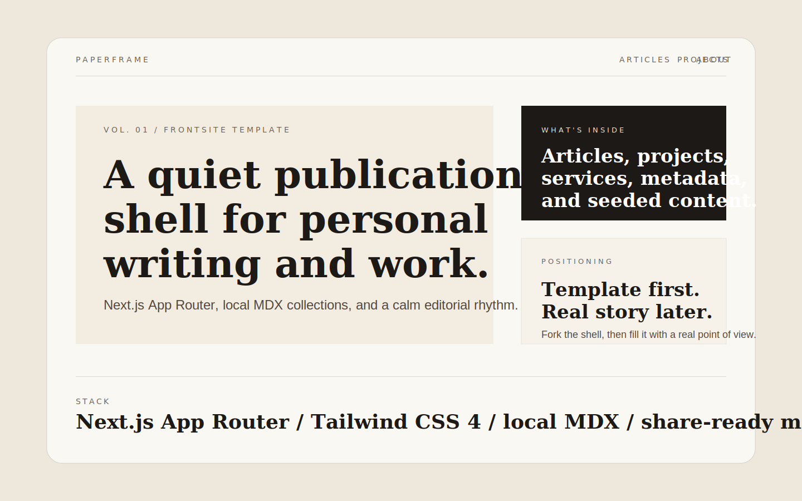

# Paperframe

Editorial-style personal site template built with Next.js App Router, Tailwind
CSS, and local MDX collections.



Paperframe is designed for people who want a public site that feels more like a
small publication than a generic startup landing page.

## Included surfaces

- `/`
- `/about`
- `/articles`
- `/articles/[slug]`
- `/projects`
- `/projects/[slug]`
- `/services`
- `/services/[slug]`
- generated `sitemap.xml`
- generated `robots.txt`
- generated app icon, Apple icon, Open Graph image, Twitter image, and web manifest

## Deliberately not included

- auth
- CMS
- database-backed stats
- tool pages
- newsletter flows
- comments
- real content migration

Those belong in the next product phase, not in the base template.

## Stack

- Next.js App Router
- React 19
- TypeScript
- Tailwind CSS 4
- local MDX content
- `gray-matter` + Zod content validation
- `next-mdx-remote/rsc` for server-rendered MDX

## Quick start

```bash
npm install
npm run dev
```

Default dev URL:

```text
http://localhost:3000
```

## Local commands

```bash
npm run dev
npm run lint
npm run typecheck
npm run build
```

`npm run dev` intentionally uses the webpack dev server instead of the default
Turbopack path because this project renders local MDX through
`next-mdx-remote/rsc`, and that combination is more stable in webpack for this
template.

## What to customize first

1. `src/lib/site-config.ts`
2. `src/content/site.ts`
3. `src/content/about.mdx`
4. `src/content/articles/*.mdx`
5. `src/content/projects/*.mdx`
6. `src/content/services/*.mdx`

If you only change those files, the rest of the UI should remain stable.

## Structure

```text
src/app/                  Routes, metadata files, generated web assets
src/components/           Presentational UI
src/content/              Local source content
src/lib/content/          MDX loading, validation, and selectors
src/lib/site-config.ts    Template-level metadata and public defaults
public/images/            Local seed imagery
docs/assets/              Repo preview assets
```

Responsibility split:

- `src/app/**`: routes, metadata, special files, and page composition
- `src/components/**`: reusable UI sections and detail/list templates
- `src/content/**`: editable public content
- `src/lib/content/**`: parsing, validation, sorting, and selectors
- `src/lib/site-config.ts`: site URL, brand name, SEO defaults, and social metadata

## Publishing checklist

Before making the repo public, replace the default template values in
`src/lib/site-config.ts`, swap the sample MDX content, and update the preview
image in `docs/assets/template-preview.svg`.

Recommended next steps:

- add a real domain
- update the generated share image styling if your brand is very different
- replace the seed SVGs in `public/images/`
- add LICENSE metadata on GitHub and enable Template Repository

## Notes

- Seed content is intentional. It proves the data contract without forcing you
  to rewrite components later.
- The current route set is intentionally content-first. Tooling pages and live
  product surfaces should be added as a separate phase.
- The original design direction was informed by the public structure and rhythm
  of [erlich.fun](https://erlich.fun/), but this repo is now packaged as a
  reusable standalone template rather than a one-off replica shell.
